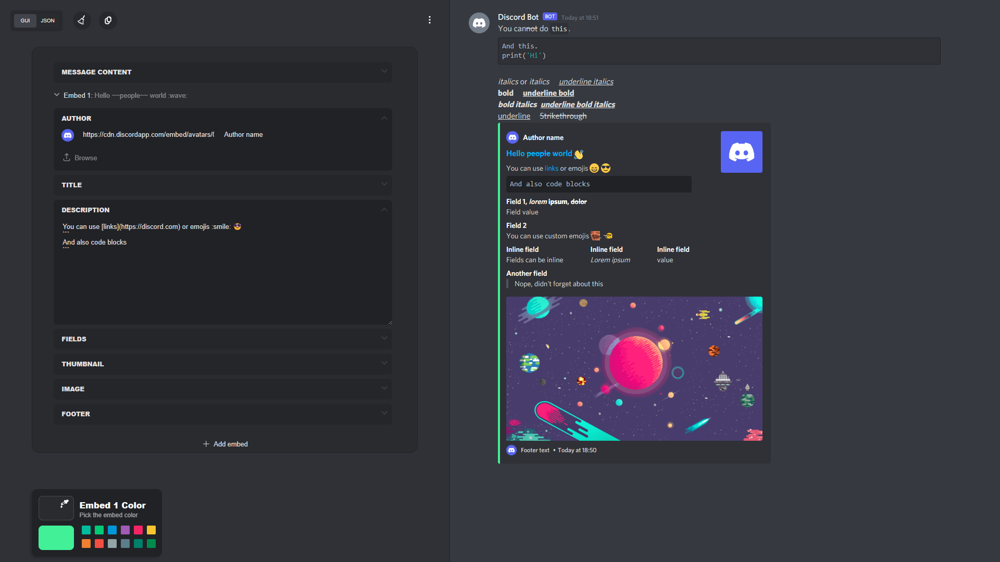
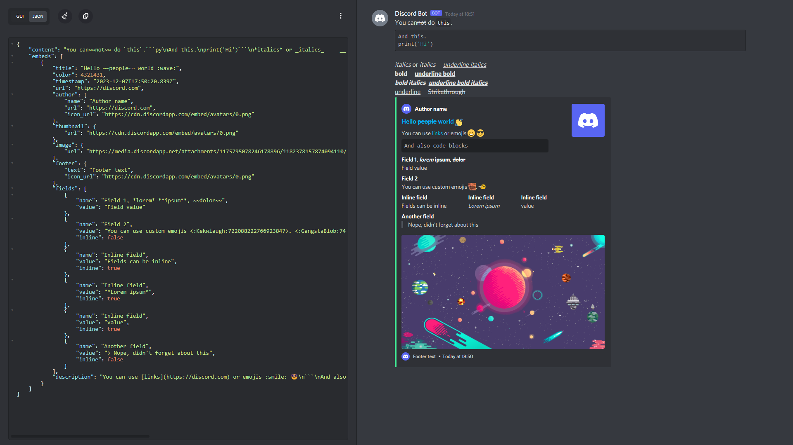

# Embed visualizer

You can use this tool to visualize, embed, or message content from either JSON input or through the provided GUI editor. It comes in handy for Discord bot embed commands.

Apart from the JSON editor, it also includes a GUI editor that makes it easier to work with by converting the content to JSON.

   


# Supported URL Parameters

## Editor param (/?editor=json)
The GUI editor is used by default. If 'editor' parameter is set with it's value set to "json", the website will use the JSON editor by default instead. Setting the value to anything else other than 'json' will be ignored.

Example URL: https://notloxik.github.io/embedBuilder/?editor=json


## Data param (/?data=...)
A data param is used to specify the dafault json data to be used when the website loads. **Note** that value of the data param should be URL encoded first, then base64 encoded last because some characters like emojis can't be Base64 encoded alone. Calling the `jsonToBase64()` or `jsonToBase64(json, true)` function does that for you and returns the encoded JSON data.

Example URL: https://notloxik.github.io/embedBuilder/?data=JTdCJTIyZW1iZWQlMjIlM0ElN0IlMjJ0aXRsZSUyMiUzQSUyMkxvcmVtJTIwaXBzdW0lMjIlMkMlMjJkZXNjcmlwdGlvbiUyMiUzQSUyMkRvbG9yJTIwc2l0JTIwYW1ldC4uLiUyMiUyQyUyMmNvbG9yJTIyJTNBMzkxMjklN0QlN0Q

## Other parameters
Params that end with `=` in the list below need a value, those that don't will always be truthy when set either with or with no value.
```
Parameter               Description
---------               -----------
username=               Used to set the default name of the bot.
avatar=                 Avatar for the bot. Either URL encode it or make this the last param.
verified                Displays a verified badge on the bot tag when set to true.
reverse                 Reverse the preview and editors position.
nouser                  Display embed or message content with no username or avatar.
embed                   Display only the embed, no editor.
guitabs=                Specify what gui tabs to display comma seperated.
                        Example: `guitabs=author` or `guitabs=image,footer`
placeholders            Silences some warrnings, e.g. warrnings about missing url protocols or incorrect footer timestamps.
                        With this param, automatic insertion of the 'http' protocol for urls written without a protocol is also disabled.
                        This param is useful when your bot allows having placeholders in place of a URL eg. `{ server.url }`
placeholders=errors     This also disables automatic insertion of 'http' for urls without a protocol.
                        Except, warnings won't be silenced. The user will still see a warning that a url or timestamp (etc.) is incorrect for 5 seconds.
hideditor               Hides the editor.
hidepreview             Hides the preview.
hidemenu                Hides the three dotted menu.
single                  Use only a single embed instead of the default multi-embeds. JSON structure will be different too.
                        When 'nomultiembedsoption' is set, this option is ignored and default builder config is used.
nomultiembedsoption     Remove multi-embeds option from the menu.
                        Together with the 'single' option, this allows
                        the developer to force the user to either use only a single or multi-embeds.
sourceOption            Display link to source code in menu. (Off by deafult unless enabled or top domain host is notloxik.github.io)
data=                   URL + Base64 encoded string of json data to be used on the embed instead of the default. 
```
